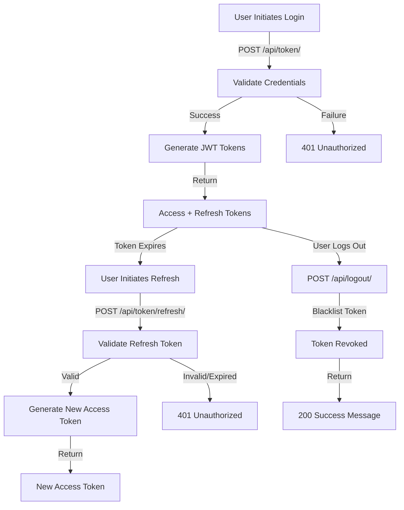
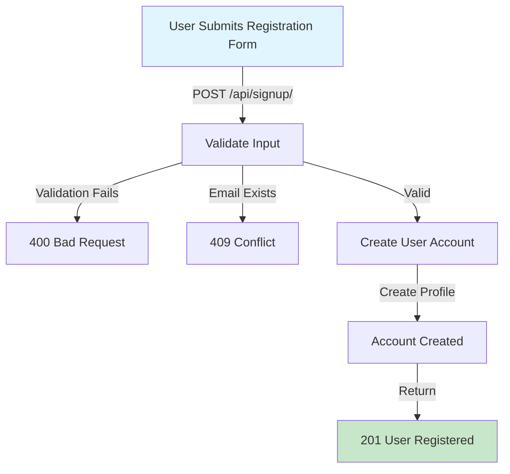
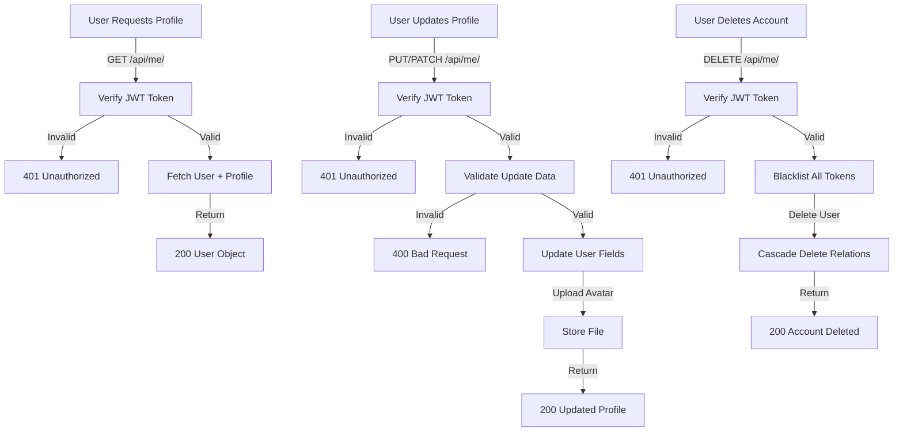
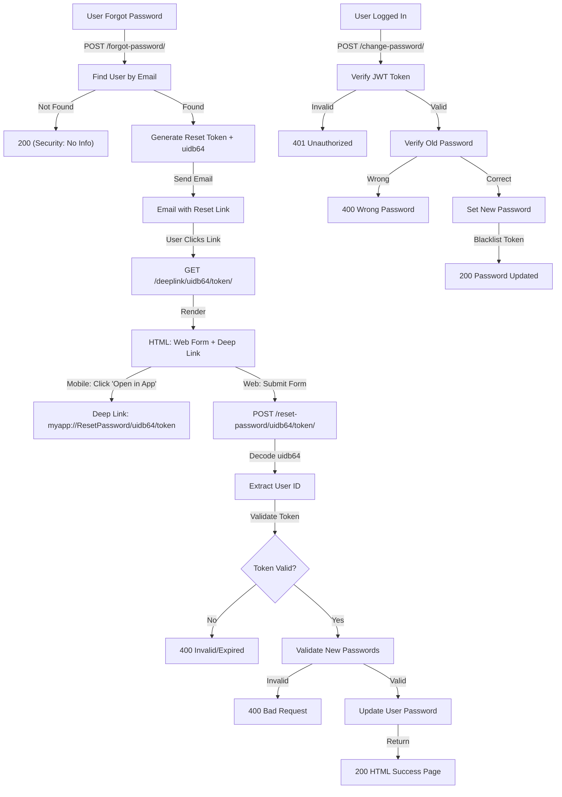
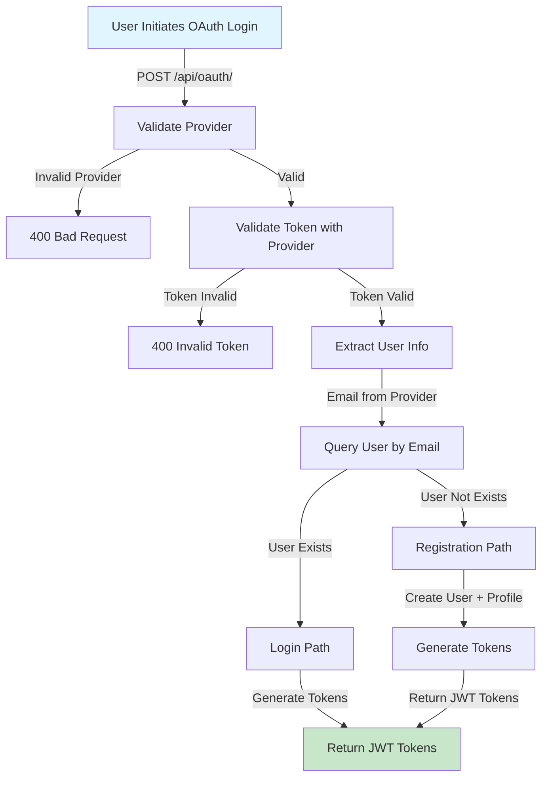
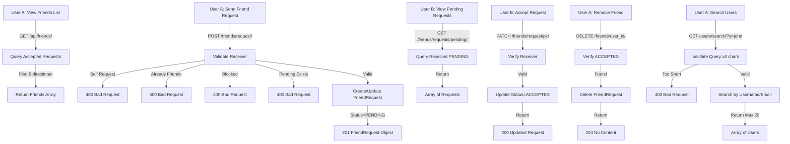
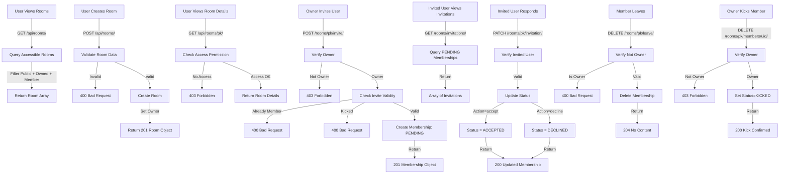
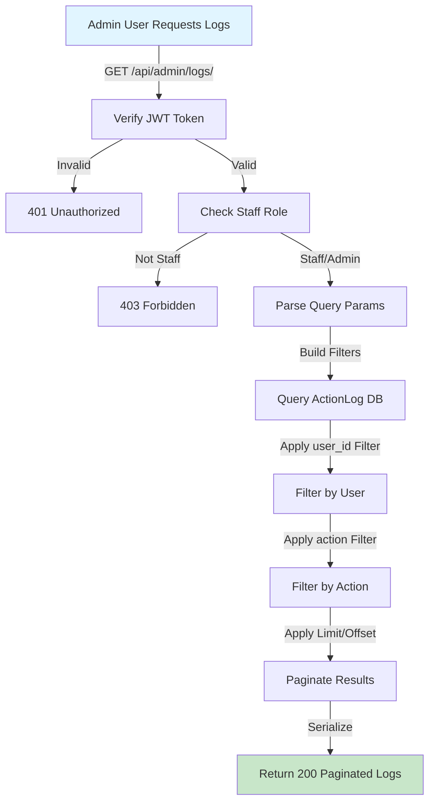
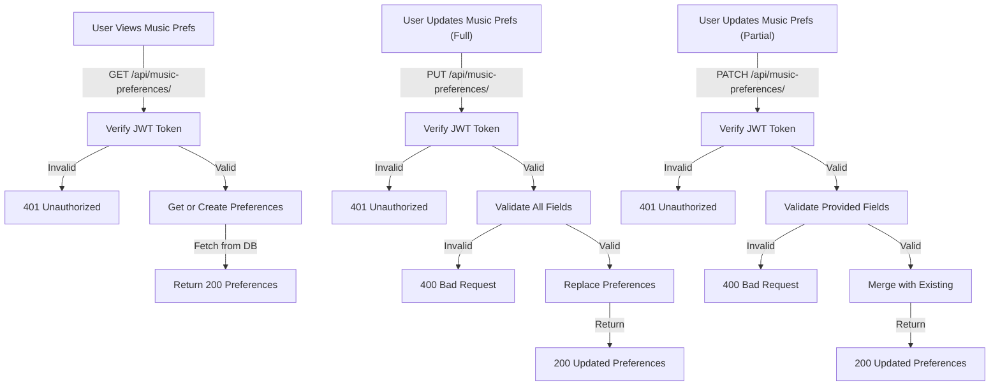
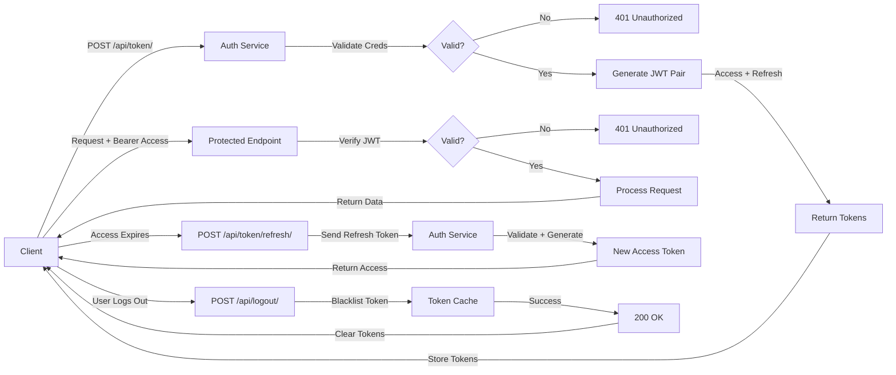

# API Schemas - Music Room Backend

**Document generated:** March 24, 2026

This document provides controller-by-controller API schemas organized by module. Each schema includes endpoint details, authentication requirements, input/output specifications, and visual flowcharts.

---

## Table of Contents

1. [Auth Controller](#auth-controller)
2. [Register Controller](#register-controller)
3. [Profile Controller](#profile-controller)
4. [Password Controller](#password-controller)
5. [OAuth Controller](#oauth-controller)
6. [Friends Controller](#friends-controller)
7. [Rooms Controller](#rooms-controller)
8. [Admin Controller](#admin-controller)
9. [Music Preferences Controller](#music-preferences-controller)

---

## Auth Controller

**Endpoints:** `/api/token/`, `/api/token/refresh/`, `/api/logout/`

### Schema

| Endpoint | Method | Purpose | Auth Required | Input | Output |
|----------|--------|---------|----------------|-------|--------|
| `/api/token/` | POST | Obtain access & refresh tokens | ❌ No | `email`, `password` | `access`, `refresh` |
| `/api/token/refresh/` | POST | Refresh expired access token | ❌ No | `refresh` (token) | `access` (new token) |
| `/api/logout/` | POST | Revoke refresh token & log out | ✅ Yes | `refresh_token` | `{ message }` |

### Details

**POST /api/token/**
- **Purpose:** User login with email/password credentials
- **Request Body:**
  ```json
  {
    "email": "user@example.com",
    "password": "password123"
  }
  ```
- **Success Response (200 OK):**
  ```json
  {
    "access": "eyJ0eXAiOiJKV1QiLCJhbGc...",
    "refresh": "eyJ0eXAiOiJKV1QiLCJhbGc..."
  }
  ```
- **Rate Limit:** 5 per minute per IP (login throttle)
- **Log:** `login` action recorded with user ID

**POST /api/token/refresh/**
- **Purpose:** Obtain new access token using refresh token
- **Request Body:**
  ```json
  {
    "refresh": "eyJ0eXAiOiJKV1QiLCJhbGc..."
  }
  ```
- **Success Response (200 OK):**
  ```json
  {
    "access": "eyJ0eXAiOiJKV1QiLCJhbGc..."
  }
  ```

**POST /api/logout/**
- **Purpose:** Invalidate refresh token (logout)
- **Auth:** Bearer token (JWT Access)
- **Request Body:**
  ```json
  {
    "refresh_token": "eyJ0eXAiOiJKV1QiLCJhbGc..."
  }
  ```
- **Success Response (200 OK):**
  ```json
  {
    "message": "Successfully logged out."
  }
  ```
- **Log:** `logout` action recorded with user ID

### Flowchart



---

## Register Controller

**Endpoints:** `/api/signup/`

### Schema

| Endpoint | Method | Purpose | Auth Required | Input | Output |
|----------|--------|---------|----------------|-------|--------|
| `/api/signup/` | POST | Create new user account | ❌ No | User data (email, password, etc.) | `{ message }` |

### Details

**POST /api/signup/**
- **Purpose:** User registration with email/password
- **Request Body:**
  ```json
  {
    "email": "newuser@example.com",
    "password": "password123",
    "password_confirm": "password123",
    "first_name": "John",
    "last_name": "Doe",
    "username": "johndoe"
  }
  ```
- **Success Response (201 Created):**
  ```json
  {
    "message": "User registered successfully."
  }
  ```
- **Error Responses:**
  - `400 Bad Request` - Invalid data or password mismatch
  - `409 Conflict` - Email/username already exists
- **Rate Limit:** 3 per hour per IP (register throttle)
- **Log:** `register` action recorded with new user ID
- **Assumptions:**
  - Email must be unique
  - Password validation (strength, length) enforced
  - Account is inactive until email verification (if applicable)

### Flowchart



---

## Profile Controller

**Endpoints:** `/api/me/`

### Schema

| Endpoint | Method | Purpose | Auth Required | Input | Output |
|----------|--------|---------|----------------|-------|--------|
| `/api/me/` | GET | Retrieve current user profile | ✅ Yes | None | User object |
| `/api/me/` | PUT/PATCH | Update current user profile | ✅ Yes | User fields | Updated user object |
| `/api/me/` | DELETE | Delete user account permanently | ✅ Yes | Bearer token | `{ message }` |

### Details

**GET /api/me/**
- **Purpose:** Get authenticated user's profile with profile relation
- **Auth:** Bearer token (JWT Access)
- **Query Parameters:** None
- **Success Response (200 OK):**
  ```json
  {
    "id": 1,
    "email": "user@example.com",
    "username": "johndoe",
    "first_name": "John",
    "last_name": "Doe",
    "profile": {
      "id": 1,
      "bio": "Music lover",
      "avatar": "https://cdn.example.com/avatars/1.jpg",
      "location": "San Francisco"
    }
  }
  ```

**PUT/PATCH /api/me/**
- **Purpose:** Update user profile (name, email, profile details, avatar)
- **Auth:** Bearer token (JWT Access)
- **Request Body (partial update):**
  ```json
  {
    "first_name": "Jonathan",
    "bio": "Updated bio",
    "avatar": "<file-multipart>"
  }
  ```
- **Success Response (200 OK):** Updated user object
- **Supported Media:** Avatar upload via MultiPartParser, FormParser

**DELETE /api/me/**
- **Purpose:** Permanently delete user account and all related data
- **Auth:** Bearer token (JWT Access)
- **Behavior:**
  - Blacklist all outstanding refresh tokens
  - Delete user record
  - Cascade delete profile, memberships, friend requests, etc.
- **Success Response (200 OK):**
  ```json
  {
    "detail": "Account deleted successfully."
  }
- **Notes:**
  - This is a destructive operation
  - All associated data is permanently deleted
  - User cannot be recovered

### Flowchart



---

## Password Controller

**Endpoints:** `/api/forgot-password/`, `/api/reset-password/{uidb64}/{token}/`, `/api/deeplink/{uidb64}/{token}/`, `/api/change-password/`

### Schema

| Endpoint | Method | Purpose | Auth Required | Input | Output |
|----------|--------|---------|----------------|-------|--------|
| `/api/forgot-password/` | POST | Request password reset link | ❌ No | `email` | `{ message }` |
| `/api/deeplink/{uidb64}/{token}/` | GET | Render password reset page | ❌ No | URL params | HTML form |
| `/api/reset-password/{uidb64}/{token}/` | POST | Reset password with token | ❌ No | `password`, `confirm_password` | HTML success page |
| `/api/change-password/` | POST | Change password (authenticated user) | ✅ Yes | Old & new password | `{ message }` |

### Details

**POST /api/forgot-password/**
- **Purpose:** Initiate password reset flow
- **Request Body:**
  ```json
  {
    "email": "user@example.com"
  }
  ```
- **Success Response (200 OK):**
  ```json
  {
    "message": "If an account with that email exists, a reset link has been sent."
  }
  ```
- **Security:**
  - Always returns 200 (prevents email enumeration)
  - Generates secure token via Django's `default_token_generator`
  - Sends HTML email with reset link
  - Token expires in 1 day (configurable)
- **Rate Limit:** 3 per hour per IP (password_reset throttle)

**GET /api/deeplink/{uidb64}/{token}/**
- **Purpose:** Render password reset UI with both web form and deep link for mobile
- **Response:** HTML page with:
  - "Open in App" button (deep link: `myapp://ResetPassword/{uidb64}/{token}`)
  - Manual password reset form pointing to `/api/reset-password/{uidb64}/{token}/`
- **Behavior:** No validation at this stage; validation happens on POST to reset endpoint

**POST /api/reset-password/{uidb64}/{token}/**
- **Purpose:** Reset password with valid token
- **Request Body:**
  ```json
  {
    "password": "newpassword123",
    "confirm_password": "newpassword123"
  }
  ```
- **Token Validation:**
  - Decode uidb64 to extract user ID
  - Verify token is valid and not expired
  - Return 400 if token invalid/expired
- **Success Response:** HTML page displaying "Password reset successful 🎉"
- **Error (400 Bad Request):**
  ```json
  {
    "error": "Invalid or expired token."
  }
  ```

**POST /api/change-password/**
- **Purpose:** Authenticated user changes their password (requires old password)
- **Auth:** Bearer token (JWT Access)
- **Request Body:**
  ```json
  {
    "old_password": "currentpassword",
    "new_password": "newpassword123",
    "refresh_token": "eyJ0eXAiOiJKV1QiLCJhbGc..." (optional)
  }
  ```
- **Success Response (200 OK):**
  ```json
  {
    "detail": "Password updated. Please log in again."
  }
  ```
- **Behavior:**
  - Verifies old password correctness
  - Sets new password
  - Optionally blacklists provided refresh token (mobile apps)
  - User must log in again

### Flowchart



---

## OAuth Controller

**Endpoints:** `/api/oauth/`

### Schema

| Endpoint | Method | Purpose | Auth Required | Input | Output |
|----------|--------|---------|----------------|-------|--------|
| `/api/oauth/` | POST | Social login (Google, Facebook) | ❌ No | `provider`, `access_token` | `access`, `refresh` tokens |

### Details

**POST /api/oauth/**
- **Purpose:** Authenticate or register user via OAuth provider
- **Supported Providers:** Google, Facebook
- **Request Body:**
  ```json
  {
    "provider": "google",
    "access_token": "<token-from-provider>"
  }
  ```
- **Success Response (200/201 OK/Created):**
  ```json
  {
    "access": "eyJ0eXAiOiJKV1QiLCJhbGc...",
    "refresh": "eyJ0eXAiOiJKV1QiLCJhbGc...",
    "user": {
      "id": 1,
      "email": "user@gmail.com",
      "first_name": "John"
    }
  }
  ```
- **Behavior:**
  - Validates token with provider (Google OAuth, Facebook Graph API)
  - Looks up user by email
  - If user exists: returns tokens (login)
  - If user not exists: creates account and returns tokens (registration)
  - Links social account to user
- **Configurations:**
  - `GOOGLE_OAUTH_CLIENT_ID` / `GOOGLE_OAUTH_CLIENT_SECRET`
  - `FACEBOOK_OAUTH_CLIENT_ID` / `FACEBOOK_OAUTH_CLIENT_SECRET`
- **Error (400 Bad Request):**
  - Invalid token
  - Unsupported provider
  - Token validation failed with provider

### Flowchart



---

## Friends Controller

**Endpoints:** `/api/friends/`, `/api/friends/request/`, `/api/friends/request/{pk}/`, `/api/friends/requests/pending/`, `/api/friends/requests/sent/`, `/api/friends/{user_id}/`, `/api/users/search/`

### Schema

| Endpoint | Method | Purpose | Auth Required | Input | Output |
|----------|--------|---------|----------------|-------|--------|
| `/api/friends/` | GET | List accepted friends | ✅ Yes | None | Array of users |
| `/api/friends/request/` | POST | Send friend request | ✅ Yes | `receiver_id` | FriendRequest object |
| `/api/friends/request/{pk}/` | GET | Get request details | ✅ Yes | None | FriendRequest object |
| `/api/friends/request/{pk}/` | PATCH | Accept/decline/block request | ✅ Yes | `action` (accept/decline/block) | Updated FriendRequest |
| `/api/friends/request/{pk}/` | DELETE | Cancel sent request | ✅ Yes | None | 204 No Content |
| `/api/friends/requests/pending/` | GET | Incoming pending requests | ✅ Yes | None | Array of FriendRequest |
| `/api/friends/requests/sent/` | GET | Sent pending requests | ✅ Yes | None | Array of FriendRequest |
| `/api/friends/{user_id}/` | DELETE | Remove friend (unfriend) | ✅ Yes | None | 204 No Content |
| `/api/users/search/` | GET | Search users by name/email | ✅ Yes | `q` (query ≥2 chars) | Array of users |

### Details

**POST /api/friends/request/**
- **Purpose:** Send friend request to another user
- **Request Body:**
  ```json
  {
    "receiver_id": 42
  }
  ```
- **Validations:**
  - Cannot send to self
  - Cannot send duplicate pending requests
  - Cannot send if already friends
  - Cannot send if blocked
- **Logic:**
  - If declined request exists: reset to pending
  - Otherwise: create new pending request
- **Success Response (201 Created / 200 OK):** FriendRequest object
- **Log:** `friend_request_sent` with receiver_id

**GET /api/friends/request/{pk}/**
- **Purpose:** Get details of a specific friend request
- **Auth:** Sender or receiver can view
- **Success Response (200 OK):** FriendRequest object with full details

**PATCH /api/friends/request/{pk}/**
- **Purpose:** Accept, decline, or block a friend request
- **Auth:** Receiver only
- **Request Body:**
  ```json
  {
    "action": "accept"  // or "decline", "block"
  }
  ```
- **Success Response (200 OK):** Updated FriendRequest object
- **Status Values:** ACCEPTED, DECLINED, BLOCKED, PENDING
- **Logs:**
  - `friend_request_accepted`
  - `friend_request_declined`
  - `friend_request_blocked`

**DELETE /api/friends/request/{pk}/**
- **Purpose:** Cancel a pending friend request
- **Auth:** Sender only, must be PENDING status
- **Success Response (204 No Content):**
- **Log:** `friend_request_cancelled`

**GET /api/friends/**
- **Purpose:** List all accepted friends
- **Success Response (200 OK):**
  ```json
  [
    {
      "id": 2,
      "username": "janedoe",
      "first_name": "Jane",
      "email": "jane@example.com"
    },
    ...
  ]
  ```
- **Logic:** Finds all ACCEPTED FriendRequests where user is sender OR receiver

**GET /api/friends/requests/pending/**
- **Purpose:** List incoming pending friend requests (where user is receiver)
- **Success Response (200 OK):** Array of FriendRequest objects with sender info

**GET /api/friends/requests/sent/**
- **Purpose:** List outgoing pending friend requests (where user is sender)
- **Success Response (200 OK):** Array of FriendRequest objects with receiver info

**DELETE /api/friends/{user_id}/**
- **Purpose:** Remove (unfriend) a friend
- **Validations:** FriendRequest must exist with ACCEPTED status
- **Success Response (204 No Content):**
- **Log:** `friend_removed` with user_id

**GET /api/users/search/**
- **Purpose:** Search for users by username, first_name, or email
- **Query Parameters:**
  - `q` (required, min 2 chars): search query
- **Success Response (200 OK):**
  ```json
  [
    {
      "id": 5,
      "username": "johnsearch",
      "first_name": "John",
      "email": "john.search@example.com"
    }
  ]
  ```
- **Behavior:**
  - Case-insensitive search
  - Returns max 20 results
  - Excludes current user
  - Returns public profile info only

### Flowchart



---

## Rooms Controller

**Endpoints:** `/api/rooms/`, `/api/rooms/mine/`, `/api/rooms/{pk}/`, `/api/rooms/{pk}/members/`, `/api/rooms/{pk}/invite/`, `/api/rooms/{pk}/invitation/`, `/api/rooms/{pk}/members/{user_id}/`, `/api/rooms/{pk}/leave/`, `/api/rooms/invitations/`

### Schema

| Endpoint | Method | Purpose | Auth Required | Input | Output |
|----------|--------|---------|----------------|-------|--------|
| `/api/rooms/` | GET | List public + my rooms | ✅ Yes | `type` (query param, optional) | Array of rooms |
| `/api/rooms/` | POST | Create new room | ✅ Yes | Room data | Room object |
| `/api/rooms/{pk}/` | GET | Get room details | ✅ Yes | None | Room object |
| `/api/rooms/{pk}/` | PATCH | Update room (owner only) | ✅ Yes | Room fields | Updated room object |
| `/api/rooms/{pk}/` | DELETE | Delete room (owner only) | ✅ Yes | None | 204 No Content |
| `/api/rooms/mine/` | GET | List rooms created by user | ✅ Yes | `type` (query param, optional) | Array of rooms |
| `/api/rooms/invitations/` | GET | List pending invitations | ✅ Yes | None | Array of memberships |
| `/api/rooms/{pk}/members/` | GET | List room members | ✅ Yes | None | Array of memberships |
| `/api/rooms/{pk}/invite/` | POST | Invite user to room | ✅ Yes | `user_id` | RoomMembership object |
| `/api/rooms/{pk}/invitation/` | PATCH | Accept/decline invitation | ✅ Yes | `action` (accept/decline) | Updated membership |
| `/api/rooms/{pk}/members/{user_id}/` | DELETE | Kick member from room | ✅ Yes | None | 200 { detail } |
| `/api/rooms/{pk}/leave/` | DELETE | Leave room voluntarily | ✅ Yes | None | 204 No Content |

### Details

**GET /api/rooms/**
- **Purpose:** List all rooms user can access (public + owned + member)
- **Query Parameters:**
  - `type` (optional): filter by room type
- **Success Response (200 OK):**
  ```json
  [
    {
      "id": 1,
      "name": "Jazz Night",
      "description": "Jazz music and discussion",
      "room_type": "music",
      "visibility": "public",
      "owner": { "id": 1, "username": "johndoe" },
      "member_count": 12,
      "is_open": true
    },
    ...
  ]
  ```
- **Filters:**
  - `visibility = PUBLIC` (public rooms)
  - `owner = current_user` (owned rooms)
  - Rooms where user has ACCEPTED membership

**POST /api/rooms/**
- **Purpose:** Create new room
- **Request Body:**
  ```json
  {
    "name": "My Music Room",
    "description": "A place for music lovers",
    "room_type": "music",
    "visibility": "private",
    "license_type": "default",
    "start_time": "2026-03-24T20:00:00Z",
    "end_time": "2026-03-24T22:00:00Z",
    "max_members": 50
  }
  ```
- **Success Response (201 Created):** Room object
- **Validations:**
  - `visibility` in [PUBLIC, PRIVATE]
  - `license_type` in [DEFAULT, INVITED, LOCATION]
  - Times must be valid
- **Owner:** Auto-set to current user
- **Log:** `room_created` with room id and name

**GET /api/rooms/{pk}/**
- **Purpose:** Get room details
- **Auth:** User must be owner or member (ACCEPTED status) or room is PUBLIC
- **Success Response (200 OK):** Room object with full details
- **Error (403 Forbidden):** User doesn't have access

**PATCH /api/rooms/{pk}/**
- **Purpose:** Update room settings
- **Auth:** Owner only
- **Request Body:** Partial room fields
- **Success Response (200 OK):** Updated room object
- **Log:** `room_updated` with room id

**DELETE /api/rooms/{pk}/**
- **Purpose:** Delete room permanently
- **Auth:** Owner only
- **Success Response (204 No Content):**
- **Cascade:** Deletes all memberships, invitations
- **Log:** `room_deleted` with room id

**GET /api/rooms/mine/**
- **Purpose:** List rooms owned by current user
- **Query Parameters:** `type` (optional)
- **Success Response (200 OK):** Array of room objects

**GET /api/rooms/invitations/**
- **Purpose:** List pending invitations for current user
- **Success Response (200 OK):**
  ```json
  [
    {
      "id": 10,
      "room": { "id": 5, "name": "Late Night Vibes" },
      "user": { "id": 2 },
      "invited_by": { "id": 1, "username": "johndoe" },
      "status": "pending",
      "created_at": "2026-03-24T18:00:00Z"
    },
    ...
  ]
  ```

**GET /api/rooms/{pk}/members/**
- **Purpose:** List members of a room
- **Auth:** User must have access to room
- **Success Response (200 OK):**
  ```json
  [
    {
      "id": 1,
      "user": { "id": 1, "username": "johndoe" },
      "status": "accepted",
      "invited_by": null,
      "created_at": "2026-03-24T10:00:00Z"
    },
    ...
  ]
  ```

**POST /api/rooms/{pk}/invite/**
- **Purpose:** Invite user to private room
- **Auth:** Owner only
- **Request Body:**
  ```json
  {
    "user_id": 42
  }
  ```
- **Success Response (201 Created):** RoomMembership object
- **Validations:**
  - Cannot invite self (owner is already member)
  - Cannot reinvite kicked users
  - Cannot duplicate invitations
- **Status:** Created with PENDING status
- **Log:** `room_invite_sent` with room id and user id

**PATCH /api/rooms/{pk}/invitation/**
- **Purpose:** Accept or decline room invitation
- **Auth:** Invited user only (PENDING status)
- **Request Body:**
  ```json
  {
    "action": "accept"  // or "decline"
  }
  ```
- **Success Response (200 OK):** Updated RoomMembership object
- **Behavior:**
  - `accept` → status = ACCEPTED
  - `decline` → status = DECLINED
- **Log:** `room_invitation_accepted` or `room_invitation_declined`

**DELETE /api/rooms/{pk}/members/{user_id}/**
- **Purpose:** Kick a member from room
- **Auth:** Owner only
- **Success Response (200 OK):**
  ```json
  {
    "detail": "User kicked from room."
  }
  ```
- **Behavior:** Sets membership status to KICKED (soft delete)
- **Log:** `room_member_kicked` with room id and user id

**DELETE /api/rooms/{pk}/leave/**
- **Purpose:** Leave room voluntarily
- **Auth:** Member only (not owner)
- **Validations:**
  - Cannot leave if owner (must delete room instead)
- **Success Response (204 No Content):**
- **Behavior:** Deletes membership record
- **Log:** `room_left` with room id

### Flowchart



---

## Admin Controller

**Endpoints:** `/api/admin/logs/`

### Schema

| Endpoint | Method | Purpose | Auth Required | Role Required | Input | Output |
|----------|--------|---------|----------------|----------------|-------|--------|
| `/api/admin/logs/` | GET | List action logs (paginated) | ✅ Yes | Staff/Admin | `user_id`, `action`, `limit`, `offset` | Paginated logs array |

### Details

**GET /api/admin/logs/**
- **Purpose:** Retrieve paginated action logs for admin/monitoring
- **Auth:** Bearer token (JWT Access) + Staff/Admin role
- **Query Parameters:**
  - `user_id` (optional): Filter by user ID
  - `action` (optional): Filter by action name (exact match)
  - `limit` (optional, default 50, max 500): Results per page
  - `offset` (optional, default 0): Pagination offset
- **Permission Check:** `IsStaffRoleUser` permission class
- **Success Response (200 OK):**
  ```json
  {
    "count": 1523,
    "offset": 0,
    "limit": 50,
    "results": [
      {
        "id": 1,
        "user_id": 5,
        "user_email": "user@example.com",
        "action": "login",
        "detail": "User 5 logged in",
        "ip_address": "192.168.1.1",
        "platform": "web",
        "device": "Chrome on macOS",
        "app_version": "1.0.0",
        "created_at": "2026-03-24T18:30:00Z"
      },
      ...
    ]
  }
  ```
- **Log Fields:**
  - `id`: Primary key
  - `user_id`: User who performed the action
  - `user_email`: Email of the user
  - `action`: Action type (login, register, friend_request_sent, room_created, etc.)
  - `detail`: Additional details/context
  - `ip_address`: Client IP address
  - `platform`: Platform (web, mobile, etc.)
  - `device`: Device string (User-Agent)
  - `app_version`: App version if applicable
  - `created_at`: Timestamp

- **Available Actions:**
  - Auth: `login`, `logout`, `register`
  - Password: `password_reset_requested`, `password_reset_completed`, `password_changed`
  - Profile: `profile_updated`, `account_deleted`
  - Friends: `friend_request_sent`, `friend_request_accepted`, `friend_request_declined`, `friend_request_cancelled`, `friend_removed`
  - Rooms: `room_created`, `room_updated`, `room_deleted`, `room_invite_sent`, `room_invitation_accepted`, `room_invitation_declined`, `room_member_kicked`, `room_left`
  - Music: `music_preferences_updated`

- **Pagination:**
  - Default limit: 50
  - Maximum limit: 500
  - Total count of records available in `count` field

### Flowchart



---

## Music Preferences Controller

**Endpoints:** `/api/music-preferences/`

### Schema

| Endpoint | Method | Purpose | Auth Required | Input | Output |
|----------|--------|---------|----------------|-------|--------|
| `/api/music-preferences/` | GET | Get user's music preferences | ✅ Yes | None | MusicPreferences object |
| `/api/music-preferences/` | PUT | Replace music preferences | ✅ Yes | Preferences data | Updated preferences |
| `/api/music-preferences/` | PATCH | Partial update preferences | ✅ Yes | Preferences fields | Updated preferences |

### Details

**GET /api/music-preferences/**
- **Purpose:** Retrieve current user's music preferences
- **Auth:** Bearer token (JWT Access)
- **Success Response (200 OK):**
  ```json
  {
    "id": 1,
    "profile": 1,
    "genres": ["jazz", "classical", "rock"],
    "favorite_artists": ["Miles Davis", "Bach", "Pink Floyd"],
    "preferred_tempo": "moderate",
    "mood": "relaxed",
    "created_at": "2026-03-24T10:00:00Z",
    "updated_at": "2026-03-24T15:00:00Z"
  }
  ```
- **Behavior:**
  - If preferences don't exist: creates default/empty preferences

**PUT /api/music-preferences/**
- **Purpose:** Replace entire music preferences (all fields)
- **Auth:** Bearer token (JWT Access)
- **Request Body:**
  ```json
  {
    "genres": ["jazz", "electronic", "indie"],
    "favorite_artists": ["John Coltrane", "Daft Punk", "The xx"],
    "preferred_tempo": "fast",
    "mood": "energetic"
  }
  ```
- **Success Response (200 OK):** Updated preferences object
- **Behavior:**
  - Updates or creates preferences
  - All fields must be provided

**PATCH /api/music-preferences/**
- **Purpose:** Partially update music preferences
- **Auth:** Bearer token (JWT Access)
- **Request Body (example - only some fields):**
  ```json
  {
    "mood": "chill"
  }
  ```
- **Success Response (200 OK):** Updated preferences object
- **Behavior:**
  - Only provided fields are updated
  - Existing fields remain unchanged

### Flowchart



---

## Summary Table

### Endpoint Count by Controller

| Controller | Endpoint Count | Key Operations |
|------------|----------------|-----------------|
| Auth | 3 | Login, Token Refresh, Logout |
| Register | 1 | User Registration |
| Profile | 1 | Get/Update/Delete User Profile |
| Password | 4 | Forgot, Reset, Deeplink, Change |
| OAuth | 1 | Social Login |
| Friends | 9 | Send/Accept/Decline Requests, List Friends, Search |
| Rooms | 12 | CRUD, Members, Invitations, Leave |
| Admin | 1 | View Action Logs |
| Music Preferences | 1 | Get/Put/Patch User Preferences |
| **Total** | **33** | - |

### Authentication Summary

| Type | Controllers | Details |
|------|-------------|---------|
| **Public (No Auth)** | Auth, Register, Password, OAuth | Account creation, login, password reset |
| **Authenticated (JWT)** | Profile, Friends, Rooms, Music Preferences | User-specific data and actions |
| **Staff/Admin (Role-based)** | Admin | Restricted to staff users only |

### Rate Limits

| Endpoint | Limit | Scope |
|----------|-------|-------|
| `/api/token/` | 5 per minute | LoginRateThrottle (IP-based) |
| `/api/signup/` | 3 per hour | RegisterRateThrottle (IP-based) |
| `/api/forgot-password/` | 3 per hour | PasswordResetRateThrottle (IP-based) |

---

## Common Response Codes

| Code | Meaning | Example Scenario |
|------|---------|-------------------|
| `200 OK` | Request successful, data returned | GET requests, successful updates |
| `201 Created` | Resource created successfully | POST creating user, room, or request |
| `204 No Content` | Request successful, no content returned | DELETE operations, logout |
| `400 Bad Request` | Invalid input or business logic violation | Missing fields, duplicate entries |
| `401 Unauthorized` | Missing or invalid authentication | Expired JWT, no token provided |
| `403 Forbidden` | Authenticated but lacking permission | Non-owner deleting room, non-receiver accepting request |
| `404 Not Found` | Resource doesn't exist | Invalid room/user ID |
| `409 Conflict` | Resource conflict (e.g., duplicate email) | Registering with existing email |
| `500 Internal Server Error` | Server error | Unexpected exception |

---

## Authentication Flow Diagram



---

## Mermaid Diagram Export Notes

All flowcharts in this document use Mermaid syntax and can be:
- Viewed directly in GitHub markdown
- Exported to SVG/PNG using Mermaid Live Editor
- Embedded in documentation or presentations
- Integrated into API documentation tools

---

**Document Version:** 1.0  
**Last Updated:** March 24, 2026  
**Backend Framework:** Django REST Framework + DRF Spectacular  
**Database:** PostgreSQL  
**Authentication:** JWT (djangorestframework-simplejwt)
