# API Schemas — Music Room Backend

**Document generated:** April 2026  
**Backend:** Django REST Framework + DRF Spectacular + Django Channels  
**Database:** PostgreSQL  
**Auth:** JWT RS256 (djangorestframework-simplejwt)  
**Real-time:** Django Channels (WebSocket) + Redis channel layer

---

## Table of Contents

1. [Auth Controller](#auth-controller)
2. [Register Controller](#register-controller)
3. [Profile Controller](#profile-controller)
4. [Password Controller](#password-controller)
5. [OAuth Controller](#oauth-controller)
6. [Friends Controller](#friends-controller)
7. [Rooms Controller](#rooms-controller)
8. [Admin Controller](#admin-controller)
9. [Music Preferences Controller](#music-preferences-controller)
10. [Music Track Vote Controller](#music-track-vote-controller)
11. [Music Control Delegation Controller](#music-control-delegation-controller)
12. [WebSocket Endpoints](#websocket-endpoints)
13. [License Management](#license-management)
14. [Summary Tables](#summary-tables)
15. [Common Response Codes](#common-response-codes)

---

## Auth Controller

**Endpoints:** `/api/token/`, `/api/token/refresh/`, `/api/logout/`

### Schema

| Endpoint | Method | Auth Required | Input | Output |
|----------|--------|----------------|-------|--------|
| `/api/token/` | POST | ❌ No | `email`, `password` | `access`, `refresh` |
| `/api/token/refresh/` | POST | ❌ No | `refresh` | `access` (new) |
| `/api/logout/` | POST | ✅ Yes | `refresh_token` | `{ message }` |

### Details

**POST /api/token/**
- **Purpose:** Login with email/password — returns JWT pair
- **Rate Limit:** 10 per minute per IP
- **Request Body:**
  ```json
  {
    "email": "user@example.com",
    "password": "YourPass1!"
  }
  ```
- **Success Response (200 OK):**
  ```json
  {
    "access": "eyJ0eXAiOiJKV1Qi...",
    "refresh": "eyJ0eXAiOiJKV1Qi..."
  }
  ```
- **JWT Claims:** `sub` (user id), `email`, `role`
- **Algorithm:** RS256 — asymmetric signing
- **Log:** `login` action recorded

**POST /api/token/refresh/**
- **Purpose:** Get a new access token before it expires
- **Request Body:**
  ```json
  { "refresh": "eyJ0eXAiOiJKV1Qi..." }
  ```
- **Success Response (200 OK):**
  ```json
  { "access": "eyJ0eXAiOiJKV1Qi..." }
  ```
- **Notes:** Rotation is enabled — a new refresh token is also returned. The old refresh token is blacklisted immediately.

**POST /api/logout/**
- **Auth:** `Authorization: Bearer <access>`
- **Request Body:**
  ```json
  { "refresh_token": "eyJ0eXAiOiJKV1Qi..." }
  ```
- **Success Response (200 OK):**
  ```json
  { "message": "Successfully logged out." }
  ```
- **Log:** `logout` action recorded

### Flowchart

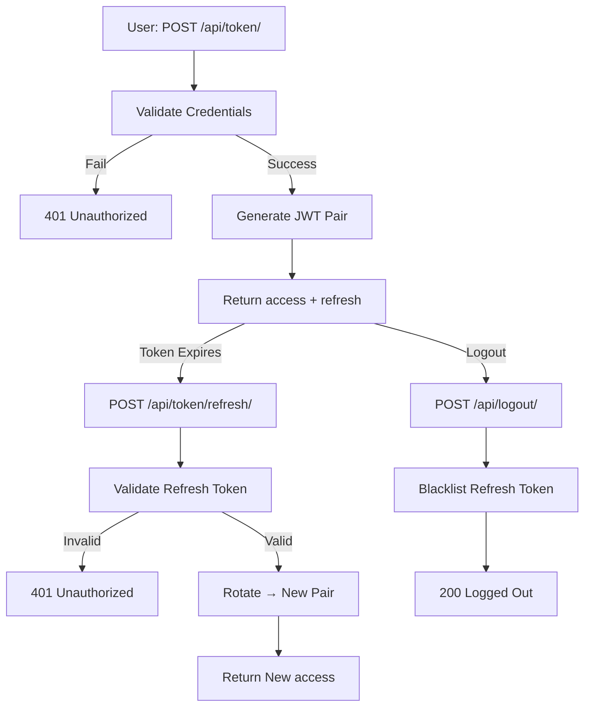

---

## Register Controller

**Endpoints:** `/api/signup/`

### Schema

| Endpoint | Method | Auth Required | Input | Output |
|----------|--------|----------------|-------|--------|
| `/api/signup/` | POST | ❌ No | `full_name`, `email`, `password`, `confirm_password` | `{ message, data }` |

### Details

**POST /api/signup/**
- **Rate Limit:** 10 per minute per IP
- **Request Body:**
  ```json
  {
    "full_name": "John Doe",
    "email": "john@example.com",
    "password": "StrongPass1!",
    "confirm_password": "StrongPass1!"
  }
  ```
- **Password Rules:** ≥8 chars — at least 1 uppercase, 1 lowercase, 1 digit, 1 special character
- **Success Response (201 Created):**
  ```json
  {
    "message": "User registered successfully.",
    "data": {
      "user": {
        "id": 7,
        "username": "7johndoe",
        "first_name": "John Doe",
        "email": "john@example.com",
        "role": "USER",
        "profile": { "bio": "", "location": "", "avatar": null, "avatar_url": "https://i.pravatar.cc/100" },
        "music_preferences": { "favorite_genres": [], "favorite_artists": [], "favorite_tracks": [] },
        "stats": { "rooms_count": 0, "friends_count": 0, "vibes_count": 0 }
      },
      "access": "eyJ...",
      "refresh": "eyJ..."
    }
  }
  ```
- **Error Responses:**
  - `400` — Validation failure, password mismatch, or strength rule violation
  - `400` — Email already in use
- **Side Effects:** Profile row auto-created via `post_save` signal; username auto-generated as `<id><slugified-full-name>`
- **Log:** `register` action recorded

### Flowchart

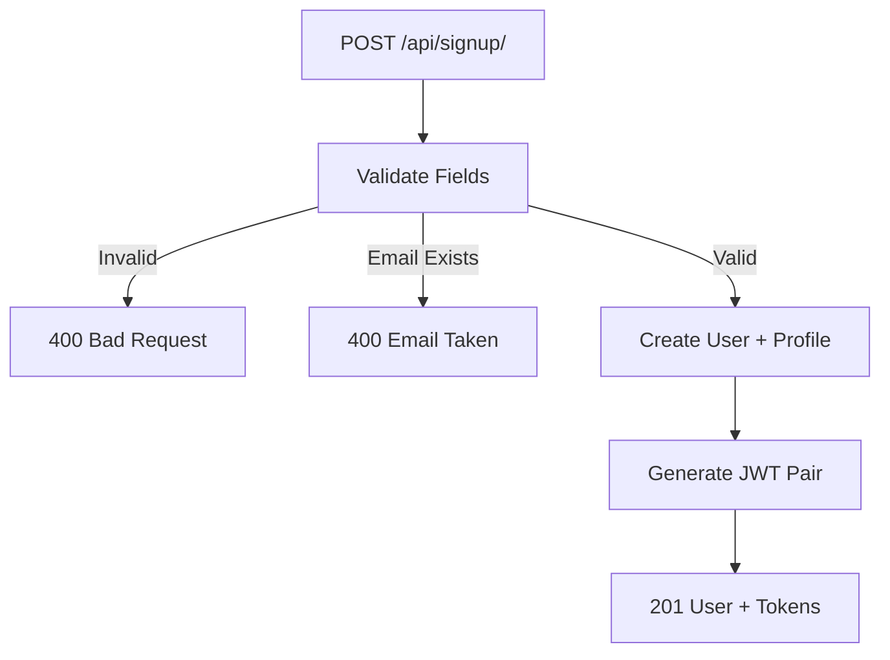

---

## Profile Controller

**Endpoints:** `/api/me/`

### Schema

| Endpoint | Method | Auth Required | Input | Output |
|----------|--------|----------------|-------|--------|
| `/api/me/` | GET | ✅ Yes | — | Full user object |
| `/api/me/` | PATCH | ✅ Yes | Any user/profile fields | Updated user object |
| `/api/me/` | DELETE | ✅ Yes | — | `{ detail }` |

### Details

**GET /api/me/**
- **Success Response (200 OK):**
  ```json
  {
    "id": 7,
    "username": "7johndoe",
    "first_name": "John Doe",
    "email": "john@example.com",
    "role": "USER",
    "profile": {
      "bio": "Music lover",
      "location": "Casablanca",
      "provider": null,
      "phone": "+212600000000",
      "phone_verified": false,
      "avatar": "http://api.example.com/media/avatars/7.jpg",
      "created_at": "2026-04-01T10:00:00Z",
      "updated_at": "2026-04-14T18:00:00Z"
    },
    "music_preferences": {
      "favorite_genres": ["jazz", "rock"],
      "favorite_artists": ["Miles Davis"],
      "favorite_tracks": [],
      "updated_at": "2026-04-10T08:00:00Z"
    },
    "stats": {
      "rooms_count": 3,
      "friends_count": 12,
      "vibes_count": 0
    }
  }
  ```

**PATCH /api/me/**
- **Content-Type:** `application/json` or `multipart/form-data` (for avatar upload)
- **Updatable fields:** `username`, `first_name`, `profile.bio`, `profile.phone`, `profile.location`, `profile.avatar`
- **Profile fields can be sent as:**
  - Flat keys: `profile.bio`, `profile.location`
  - Nested JSON: `{ "profile": { "bio": "..." } }`
- **Avatar:** JPEG / PNG / WEBP, max 2 MB — send as `multipart/form-data`
- **Success Response (200 OK):** Updated user object (same shape as GET)

**DELETE /api/me/**
- **Action:** Blacklists all outstanding refresh tokens, then hard-deletes the user row (cascade deletes profile, rooms, memberships, friend requests)
- **Success Response (200 OK):**
  ```json
  { "detail": "Account deleted successfully." }
  ```

### Flowchart

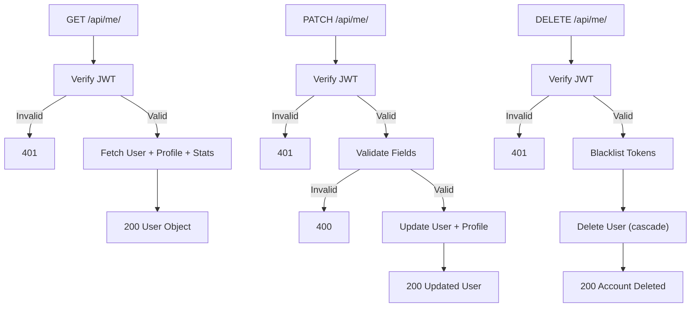

---

## Password Controller

**Endpoints:** `/api/forgot-password/`, `/api/verify-reset-code/`, `/api/reset-password/`, `/api/change-password/`

### Schema

| Endpoint | Method | Auth Required | Input | Output |
|----------|--------|----------------|-------|--------|
| `/api/forgot-password/` | POST | ❌ No | `email` | `{ message }` |
| `/api/verify-reset-code/` | POST | ❌ No | `email`, `code` (6 digits) | `{ reset_token }` |
| `/api/reset-password/` | POST | ❌ No | `reset_token`, `password`, `confirm_password` | `{ message }` |
| `/api/change-password/` | POST | ✅ Yes | `old_password`, `new_password`, `confirm_password`, `refresh_token` | `{ detail }` |

### Details

**POST /api/forgot-password/**
- **Rate Limit:** 5 per minute per IP
- **Request Body:**
  ```json
  { "email": "user@example.com" }
  ```
- **Success Response (200 OK):**
  ```json
  { "message": "If an account with that email exists, a 6-digit reset code has been sent." }
  ```
- **Security:** Always returns 200 even if the email doesn't exist (prevents enumeration)
- **Side Effect:** Sends an email containing a **6-digit numeric code** valid for 15 minutes (max 5 attempts)

**POST /api/verify-reset-code/**
- **Purpose:** Validate the 6-digit code from the email; trade it for a `reset_token` UUID
- **Request Body:**
  ```json
  {
    "email": "user@example.com",
    "code": "482913"
  }
  ```
- **Success Response (200 OK):**
  ```json
  {
    "message": "Code verified. Use the reset_token to reset your password.",
    "reset_token": "550e8400-e29b-41d4-a716-446655440000"
  }
  ```
- **Error (400 Bad Request):** Invalid/expired code; too many attempts

**POST /api/reset-password/**
- **Purpose:** Set a new password using the verified `reset_token`
- **Request Body:**
  ```json
  {
    "reset_token": "550e8400-e29b-41d4-a716-446655440000",
    "password": "NewPass1!",
    "confirm_password": "NewPass1!"
  }
  ```
- **Success Response (200 OK):**
  ```json
  { "message": "Password reset successfully. Please log in with your new password." }
  ```
- **Error (400):** Token already used, expired, or passwords don't match

**POST /api/change-password/**
- **Auth:** `Authorization: Bearer <access>`
- **Request Body:**
  ```json
  {
    "old_password": "CurrentPass1!",
    "new_password": "NewPass1!",
    "confirm_password": "NewPass1!",
    "refresh_token": "eyJ..."
  }
  ```
  > `refresh_token` is **optional** — include it to blacklist the current session immediately (recommended for mobile)
- **Success Response (200 OK):**
  ```json
  { "detail": "Password updated. Please log in again." }
  ```

### Flowchart

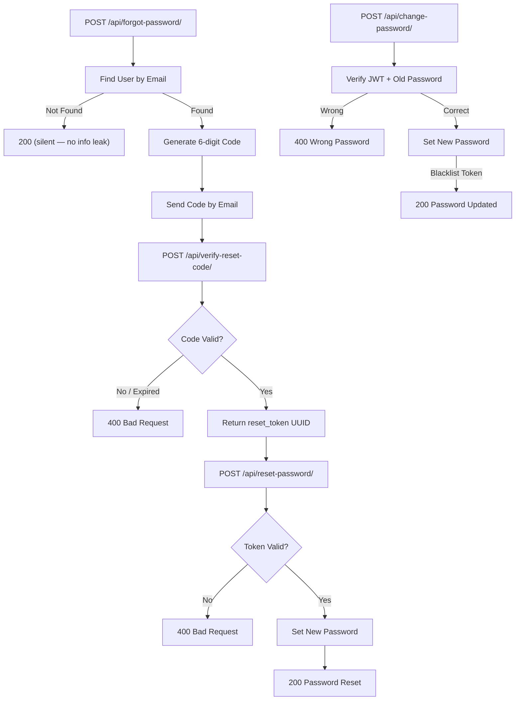

---

## OAuth Controller

**Endpoints:** `/api/oauth/`

### Schema

| Endpoint | Method | Auth Required | Input | Output |
|----------|--------|----------------|-------|--------|
| `/api/oauth/` | POST | ❌ No | `provider`, `token` | `access`, `refresh`, user |

### Details

**POST /api/oauth/**
- **Supported Providers:** `google`, `facebook`
- **`google`** → send the **id_token** from Google Sign-In
- **`facebook`** → send the **access_token** from Facebook Login
- **Request Body:**
  ```json
  {
    "provider": "google",
    "token": "<id_token or access_token from provider>"
  }
  ```
- **Success Response (200 OK):**
  ```json
  {
    "message": "OAuth login successful.",
    "data": {
      "user": { "id": 1, "email": "user@gmail.com", ... },
      "access": "eyJ...",
      "refresh": "eyJ..."
    }
  }
  ```
- **Behaviour:** Verifies token with provider → looks up user by `email` → creates account if not found → returns JWT pair
- **Config required:** `GOOGLE_OAUTH_CLIENT_ID`, `FACEBOOK_OAUTH_CLIENT_ID`, `FACEBOOK_OAUTH_CLIENT_SECRET`
- **Error (400):** Invalid token, unsupported provider, email not verified (Google)

### Flowchart

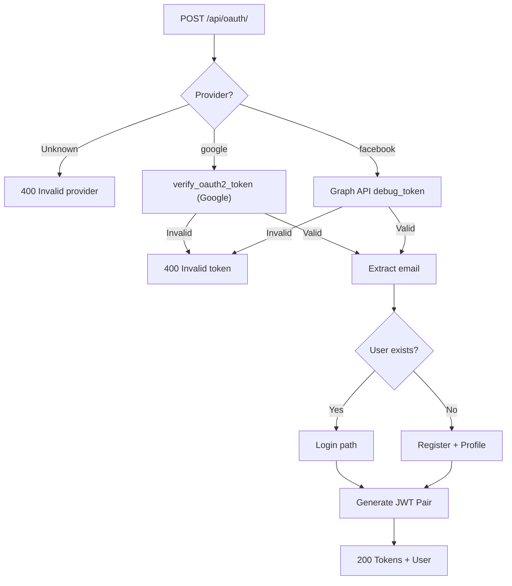

---

## Friends Controller

**Endpoints:** `/api/friends/*`, `/api/users/search/`

### Schema

| Endpoint | Method | Auth | Input | Output |
|----------|--------|------|-------|--------|
| `/api/friends/` | GET | ✅ | — | Paginated friends list |
| `/api/friends/request/` | POST | ✅ | `receiver_id` | FriendRequest |
| `/api/friends/request/<pk>/` | GET | ✅ | — | FriendRequest |
| `/api/friends/request/<pk>/` | PATCH | ✅ | `action` (accept/decline/block) | Updated FriendRequest |
| `/api/friends/request/<pk>/` | DELETE | ✅ | — | 204 No Content |
| `/api/friends/requests/pending/` | GET | ✅ | — | Paginated incoming requests |
| `/api/friends/requests/sent/` | GET | ✅ | — | Paginated outgoing requests |
| `/api/friends/<user_id>/` | DELETE | ✅ | — | 204 No Content |
| `/api/users/search/` | GET | ✅ | `?q=<query>` (min 2 chars) | Paginated user list |

### Key Behaviours

**POST /api/friends/request/**
```json
{ "receiver_id": 42 }
```
- Cannot send to self, to an already-accepted friend, or to a blocked/pending target
- If a declined request exists → resets it to `pending`
- **Log:** `friend_request_sent`

**PATCH /api/friends/request/\<pk\>/**
```json
{ "action": "accept" }
```
- `action` choices: `accept`, `decline`, `block`
- Receiver only — sender cannot respond to their own request
- **Log:** `friend_request_accepted | declined | blocked`

**FriendRequest Response Object:**
```json
{
  "id": 10,
  "sender_id": 1, "sender_email": "a@x.com", "sender_username": "alice",
  "receiver_id": 2, "receiver_email": "b@x.com", "receiver_username": "bob",
  "status": "pending",
  "created_at": "2026-04-14T10:00:00Z",
  "updated_at": "2026-04-14T10:00:00Z"
}
```

**GET /api/users/search/?q=john**
- Case-insensitive match on `username`, `first_name`, `email`
- Returns max 20 results; excludes the requesting user

### Flowchart

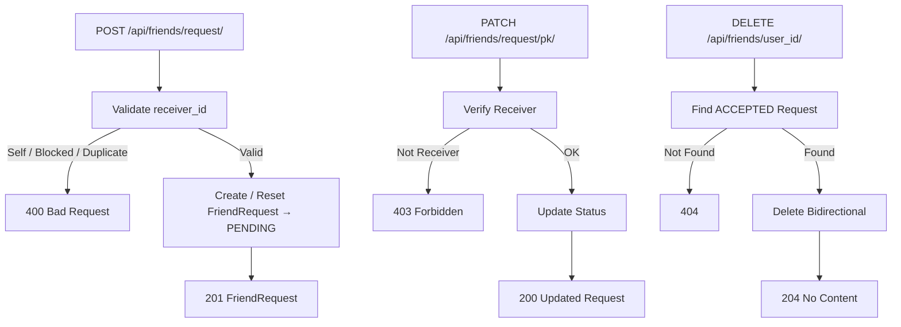

---

## Rooms Controller

**Endpoints:** `/api/rooms/*`

### Schema

| Endpoint | Method | Auth | Input | Output |
|----------|--------|------|-------|--------|
| `/api/rooms/` | GET | ✅ | `?type=` (optional) | Room list |
| `/api/rooms/` | POST | ✅ | Room fields | Room object |
| `/api/rooms/mine/` | GET | ✅ | `?type=` (optional) | Room list (owned) |
| `/api/rooms/invitations/` | GET | ✅ | — | Pending invitations |
| `/api/rooms/<pk>/` | GET | ✅ | — | Room object |
| `/api/rooms/<pk>/` | PATCH | ✅ (owner) | Room fields | Updated room |
| `/api/rooms/<pk>/` | DELETE | ✅ (owner) | — | 204 |
| `/api/rooms/<pk>/members/` | GET | ✅ | — | Members list |
| `/api/rooms/<pk>/invite/` | POST | ✅ (owner) | `user_id` | RoomMembership |
| `/api/rooms/<pk>/invitation/` | PATCH | ✅ (invited) | `action` (accept/decline) | Updated membership |
| `/api/rooms/<pk>/members/<user_id>/` | DELETE | ✅ (owner) | — | `{ detail }` |
| `/api/rooms/<pk>/leave/` | DELETE | ✅ (member) | — | 204 |

### Room Object (camelCase — matches RoomSerializer)

```json
{
  "id": 1,
  "name": "Jazz Night",
  "description": "Chill jazz vibes",
  "coverImage": "https://cdn.example.com/room1.jpg",
  "isPublic": true,
  "isLive": false,
  "participantCount": 8,
  "host": "johndoe",
  "genres": ["jazz", "soul"],
  "createdAt": "2026-04-01T20:00:00Z",
  "currentTrack": { ... },
  "room_type": "vote",
  "visibility": "public",
  "license_type": "default"
}
```

> `currentTrack` — for `vote`-type rooms this is the top-ranked track (highest `vote_count`). `null` for delegation rooms and when the queue is empty.

### POST /api/rooms/ — Create Room
```json
{
  "name": "My Room",
  "description": "Optional desc",
  "room_type": "vote",
  "visibility": "public",
  "license_type": "default",
  "coverImage": "https://...",
  "genres": ["pop", "edm"]
}
```
- `room_type`: `vote` | `delegation`
- `visibility`: `public` | `private`
- `license_type`: `default` | `invited` | `location`
- **Log:** `room_created`

### RoomMembership Object
```json
{
  "id": 5,
  "user_id": 42,
  "user_email": "alice@example.com",
  "user_username": "alice",
  "status": "pending",
  "invited_by_id": 1,
  "created_at": "2026-04-10T09:00:00Z",
  "updated_at": "2026-04-10T09:00:00Z"
}
```

### Flowchart

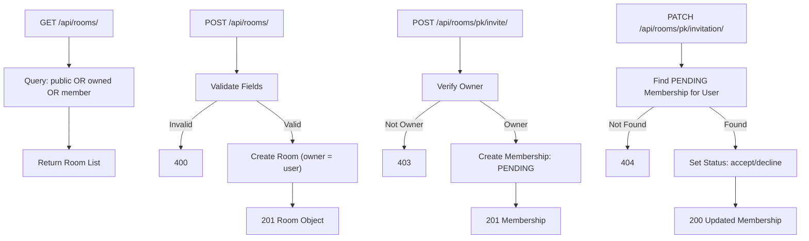

---

## Admin Controller

**Endpoints:** `/api/users/`, `/api/users/<pk>/`, `/api/admin/logs/`

### Schema

| Endpoint | Method | Auth | Role | Input | Output |
|----------|--------|------|------|-------|--------|
| `/api/users/` | GET | ✅ | Staff/Admin | — | Paginated user list |
| `/api/users/<pk>/` | GET | ✅ | Staff/Admin | — | User object |
| `/api/users/<pk>/` | PATCH | ✅ | Staff/Admin | User fields | Updated user |
| `/api/users/<pk>/` | DELETE | ✅ | Staff/Admin | — | 200 deleted |
| `/api/admin/logs/` | GET | ✅ | Staff/Admin | `user_id`, `action` (filters) | Paginated ActionLog list |

### GET /api/admin/logs/ — Action Log Response
```json
{
  "count": 1523,
  "next": "http://api/admin/logs/?page=2",
  "previous": null,
  "results": [
    {
      "id": 1,
      "user_id": 5,
      "user_email": "user@example.com",
      "action": "login",
      "detail": "User 5 logged in",
      "ip_address": "192.168.1.1",
      "platform": "web",
      "device": "Chrome on macOS",
      "app_version": "1.0.0",
      "created_at": "2026-04-14T18:30:00Z"
    }
  ]
}
```

### Available Action Log Events

| Module | Actions |
|--------|---------|
| Auth | `login`, `logout`, `register` |
| Password | `password_reset_requested`, `password_reset_completed`, `password_changed` |
| Profile | `profile_updated`, `account_deleted` |
| Friends | `friend_request_sent`, `friend_request_accepted`, `friend_request_declined`, `friend_request_blocked`, `friend_request_cancelled`, `friend_removed` |
| Rooms | `room_created`, `room_updated`, `room_deleted`, `room_invite_sent`, `room_invitation_accepted`, `room_invitation_declined`, `room_member_kicked`, `room_left` |
| Music Prefs | `music_preferences_updated` |
| Track Vote | `track_suggested`, `track_voted`, `track_deleted` |
| Delegation | `device_registered`, `control_delegated`, `control_revoked` |

### Flowchart

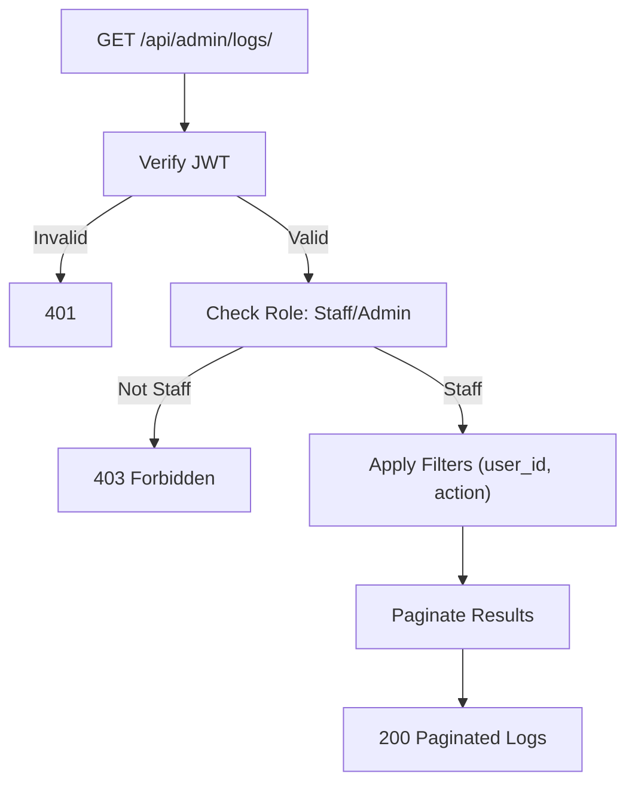

---

## Music Preferences Controller

**Endpoints:** `/api/music-preferences/`

### Schema

| Endpoint | Method | Auth | Input | Output |
|----------|--------|------|-------|--------|
| `/api/music-preferences/` | GET | ✅ | — | MusicPreferences object |
| `/api/music-preferences/` | PUT | ✅ | All preference fields | Updated preferences |
| `/api/music-preferences/` | PATCH | ✅ | Any subset of fields | Updated preferences |

### MusicPreferences Object
```json
{
  "favorite_genres": ["jazz", "rock", "electronic"],
  "favorite_artists": ["Miles Davis", "Daft Punk"],
  "favorite_tracks": ["track-spotify-id-1"],
  "updated_at": "2026-04-10T08:00:00Z"
}
```

- **GET:** Returns existing preferences or creates empty defaults on first access
- **PUT:** Replaces all fields
- **PATCH:** Merges — only provided fields are mutated
- **Log:** `music_preferences_updated`

---

## Music Track Vote Controller

**Endpoints:** `/api/events/<room_id>/tracks/*`

### Schema

| Endpoint | Method | Auth | Input | Output |
|----------|--------|------|-------|--------|
| `/api/events/<room_id>/tracks/` | GET | ✅ | — | Paginated Track list (ranked) |
| `/api/events/<room_id>/tracks/` | POST | ✅ | Spotify track fields | Track object |
| `/api/events/<room_id>/tracks/<track_id>/vote/` | POST | ✅ | _(optional `lat`, `lon`)_ | `{ detail, track }` |
| `/api/events/<room_id>/tracks/<track_id>/` | DELETE | ✅ | — | 204 No Content |

> All endpoints require the room to have `room_type = "vote"`. This is validated on every request. Non-vote rooms respond with `400`.

---

### GET /api/events/\<room_id\>/tracks/

- **Purpose:** List all tracks in a vote-type room, ranked by `vote_count` (descending). Tie-breaking: `created_at` DESC → `id` DESC.
- **License Check:** User must pass the room's license requirements.
- **Pagination:** Standard DRF page-number pagination (default page size: 50).
- **Response (200 OK):**
  ```json
  {
    "count": 12,
    "next": "http://api/api/events/5/tracks/?page=2",
    "previous": null,
    "results": [
      {
        "id": "1",
        "spotifyId": "4iV5W9uYEdYUVa79Axb7Rh",
        "title": "Blinding Lights",
        "artist": "The Weeknd",
        "album": "After Hours",
        "albumArt": "https://i.scdn.co/image/ab67616d0000b273ef017e899c0547...",
        "duration": 200,
        "audioUrl": "https://p.scdn.co/mp3-preview/b61b3c0b0...",
        "votes": 12,
        "vote_count": 12,
        "rank": 1,
        "has_voted": true,
        "addedBy": {
          "name": "johndoe",
          "avatar": "https://i.pravatar.cc/100"
        }
      }
    ]
  }
  ```
- **Field Notes:**
  - `spotifyId` — Spotify Track ID (unique within the room)
  - `albumArt` — Spotify album cover URL
  - `audioUrl` — Spotify 30-second preview URL (`preview_url`)
  - `duration` — duration in seconds
  - `votes` — camelCase alias for `vote_count` (frontend primary)
  - `vote_count` — integer, also exposed for backend/admin compatibility
  - `rank` — 1-based position computed via DB window function; always contiguous (1, 2, 3 …)
  - `has_voted` — `true` if the requesting user has already voted for this track
  - `addedBy.name` — username of the user who suggested the track
- **Errors:**
  - `400` — Room is not vote-type
  - `401` — Missing/invalid JWT
  - `403` — License check failed

---

### POST /api/events/\<room_id\>/tracks/ — Suggest a Spotify Track

- **Purpose:** Add a Spotify track to the room's vote queue.
- **How:** The frontend fetches track metadata from Spotify, then POSTs it here. The backend stores it and never calls the Spotify API directly.
- **License Check:** Enforced before mutation.

**Request Body:**
```json
{
  "spotifyId": "4iV5W9uYEdYUVa79Axb7Rh",
  "title": "Blinding Lights",
  "artist": "The Weeknd",
  "album": "After Hours",
  "albumArt": "https://i.scdn.co/image/ab67616d0000b273ef017e899c0547...",
  "duration": 200,
  "audioUrl": "https://p.scdn.co/mp3-preview/b61b3c0b0..."
}
```

| Field | Required | Description |
|-------|----------|-------------|
| `spotifyId` | ✅ Yes | Spotify Track ID — enforces `unique_together (room, spotify_id)` |
| `title` | ✅ Yes | Track title |
| `artist` | ✅ Yes | Artist name |
| `album` | ❌ Optional | Album name |
| `albumArt` | ❌ Optional | Album cover image URL |
| `duration` | ❌ Optional | Duration in seconds (default 0) |
| `audioUrl` | ❌ Optional | Spotify 30-second preview URL |

- **For geo-restricted rooms:** also include `lat` (float) and `lon` (float) in the body.

**Success Response (201 Created):** Track object (same shape as list results)

**Error Responses:**
- `400` — Missing required field, blank `spotifyId`, non-vote room
- `401` — Missing JWT
- `403` — License check failed (not a member / outside geo-fence / outside time window)
- `409 Conflict` — Same `spotifyId` already exists in this room

**Log:** `track_suggested`  
**WebSocket Broadcast:** `track.added` event sent to group `vote_<room_id>`

---

### POST /api/events/\<room_id\>/tracks/\<track_id\>/vote/

- **Purpose:** Vote for a track. Atomically increments `vote_count`. One vote per user per track (DB-enforced).
- **License Check:** Enforced before mutation.
- **Request Body:** Empty — or include `lat`/`lon` for geo-restricted rooms.
- **Concurrency Safety:** `transaction.atomic()` + `F('vote_count') + 1` + `Vote.unique_together ('track', 'user')`

**Success Response (200 OK):**
```json
{
  "detail": "Vote recorded.",
  "track": {
    "id": "1",
    "spotifyId": "4iV5W9uYEdYUVa79Axb7Rh",
    "title": "Blinding Lights",
    "artist": "The Weeknd",
    "album": "After Hours",
    "albumArt": "https://i.scdn.co/image/...",
    "duration": 200,
    "audioUrl": "https://p.scdn.co/mp3-preview/...",
    "votes": 13,
    "vote_count": 13,
    "rank": 1,
    "has_voted": true,
    "addedBy": { "name": "johndoe", "avatar": "https://i.pravatar.cc/100" }
  }
}
```

**Error Responses:**
- `400` — Already voted: `{ "detail": "You have already voted for this track." }`
- `403` — License check failed
- `404` — Track not found in this room: `{ "detail": "Track not found in this room." }`

**Log:** `track_voted`  
**WebSocket Broadcast:** `vote.update` event sent to group `vote_<room_id>`

---

### DELETE /api/events/\<room_id\>/tracks/\<track_id\>/

- **Purpose:** Remove a track from the room's vote queue.
- **Permission:** Room owner **or** the user who suggested the track. Anyone else → `403`.
- **Success Response:** `204 No Content`
- **Error (403):**
  ```json
  { "detail": "Only the room owner or the track suggester can delete this track." }
  ```
- **Side Effects:** Cascade-deletes all `Vote` rows for this track; `unique_together` is released so the same `spotifyId` can be re-added.
- **Log:** `track_deleted`  
- **WebSocket Broadcast:** `track.removed` event sent to group `vote_<room_id>`

---

### Flowchart

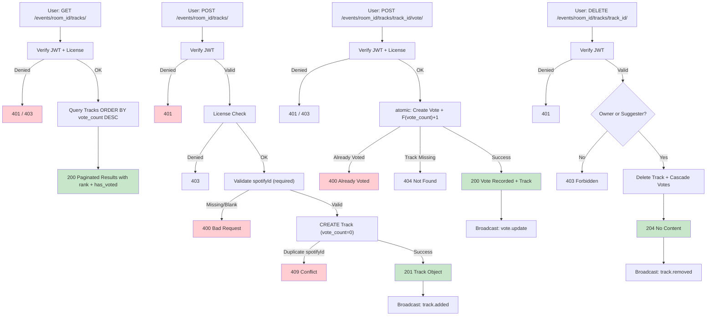

---

## Music Control Delegation Controller

**Endpoints:** `/api/delegation/<room_id>/devices/*`

### Schema

| Endpoint | Method | Auth | Input | Output |
|----------|--------|------|-------|--------|
| `/api/delegation/<room_id>/devices/` | GET | ✅ | — | Paginated DeviceDelegation list |
| `/api/delegation/<room_id>/devices/` | POST | ✅ | `device_identifier`, `device_name` | DeviceDelegation object |
| `/api/delegation/<room_id>/devices/<device_id>/delegate/` | POST | ✅ (owner) | `friend_id` | Updated DeviceDelegation |
| `/api/delegation/<room_id>/devices/<device_id>/revoke/` | POST | ✅ (owner) | — | Updated DeviceDelegation |
| `/api/delegation/<room_id>/devices/<device_id>/status/` | GET | ✅ | — | DeviceDelegation object |

> All endpoints require `room_type = "delegation"`. Non-delegation rooms return `400`.

### DeviceDelegation Object
```json
{
  "id": 1,
  "room": 15,
  "device_identifier": "uuid-abc-123",
  "device_name": "Living Room Speaker",
  "owner_id": 3,
  "owner_username": "johndoe",
  "delegated_to_id": 7,
  "delegated_to_username": "janedoe",
  "status": "active",
  "created_at": "2026-04-14T18:00:00Z",
  "updated_at": "2026-04-14T20:30:00Z"
}
```

### Details

**POST /api/delegation/\<room_id\>/devices/** — Register Device
```json
{ "device_identifier": "uuid-ghi-789", "device_name": "Bedroom Speaker" }
```
- Constraint: `unique_together (room, device_identifier)` → `409` if already registered
- **Log:** `device_registered`

**POST /api/delegation/\<room_id\>/devices/\<device_id\>/delegate/** — Delegate
```json
{ "friend_id": 7 }
```
- **Owner only** — `403` for anyone else
- Cannot delegate to self → `400`
- Sets `delegated_to = user` with `status = "active"`
- **Log:** `control_delegated`
- **WebSocket Broadcast:** `delegation_update` (event: `delegated`) to group `delegation_<room_id>`

**POST /api/delegation/\<room_id\>/devices/\<device_id\>/revoke/** — Revoke
- **Owner only**
- Sets `delegated_to = null`, `status = "revoked"`
- **Log:** `control_revoked`
- **WebSocket Broadcast:** `delegation_update` (event: `revoked`) to group `delegation_<room_id>`

### Flowchart

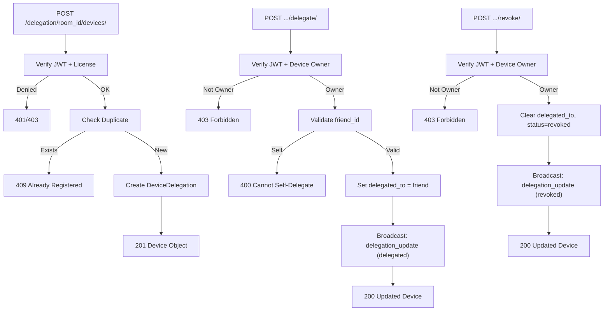

---

## WebSocket Endpoints

All music services push real-time updates to connected clients via **Django Channels**.

### Schema

| WebSocket Path | Service | Channel Group | Auth | Events |
|----------------|---------|---------------|------|--------|
| `ws/events/<room_id>/` | Track Vote | `vote_<room_id>` | `?token=<jwt>` | `initial_state`, `track.added`, `vote.update`, `track.removed` |
| `ws/delegation/<room_id>/` | Delegation | `delegation_<room_id>` | `?token=<jwt>` | `initial_state`, `delegation_update` |

### Connection

- **URL:** `ws://<host>/ws/<service>/<room_id>/?token=<access_jwt>`
- **Auth:** JWT passed as query param — validated by `JWTAuthMiddleware` before the consumer runs
- **On connect failure** (invalid token / no room access): connection is closed immediately
- **On success:** client is added to the room group and receives an `initial_state` message

### Messages

**initial_state** (sent once on connect):
```json
{
  "type": "initial_state",
  "tracks": [ ... ]
}
```

**track.added** (after `POST /api/events/<room_id>/tracks/`):
```json
{
  "type": "track.added",
  "tracks": [ ... ]
}
```

**vote.update** (after `POST .../vote/`):
```json
{
  "type": "vote.update",
  "tracks": [
    { "id": "1", "spotifyId": "4iV5W9uYEdYUVa79Axb7Rh", "title": "Blinding Lights", "votes": 13, "vote_count": 13, "rank": 1, ... },
    { "id": "2", "spotifyId": "3n3Ppam7vgaVa1iaRUIOKE", "title": "Shape of You", "votes": 8, "vote_count": 8, "rank": 2, ... }
  ]
}
```

**track.removed** (after `DELETE /api/events/<room_id>/tracks/<track_id>/`):
```json
{
  "type": "track.removed",
  "tracks": [ ... ]
}
```

**delegation_update** (after delegate or revoke):
```json
{
  "type": "delegation_update",
  "event": "delegated",
  "device": {
    "id": 1,
    "device_name": "Living Room Speaker",
    "delegated_to_id": 7,
    "status": "active"
  }
}
```

### Real-time Geo-fencing Note

WebSocket connections are **read-only** — they only receive data. Geo-fencing is enforced on every **REST API mutation** (suggest, vote, delegate). A connected client outside the geo-fence simply can't execute any mutation; they can only watch the updates.

### Flowchart

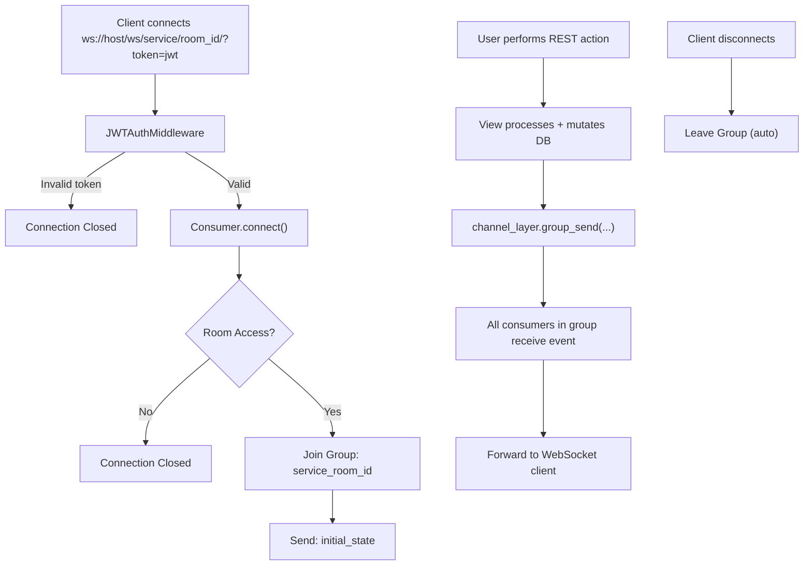

---

## License Management

All music services use a shared `check_license(user, room, user_lat, user_lon)` utility.

### License Levels

| `license_type` | Rule |
|----------------|------|
| `default` | **Public rooms:** everyone allowed. **Private rooms:** owner + accepted members only |
| `invited` | Owner + explicitly invited (accepted) users only — regardless of room visibility |
| `location` | Must be within geo-fence radius (haversine) **and** within the active time window |

### Flowchart

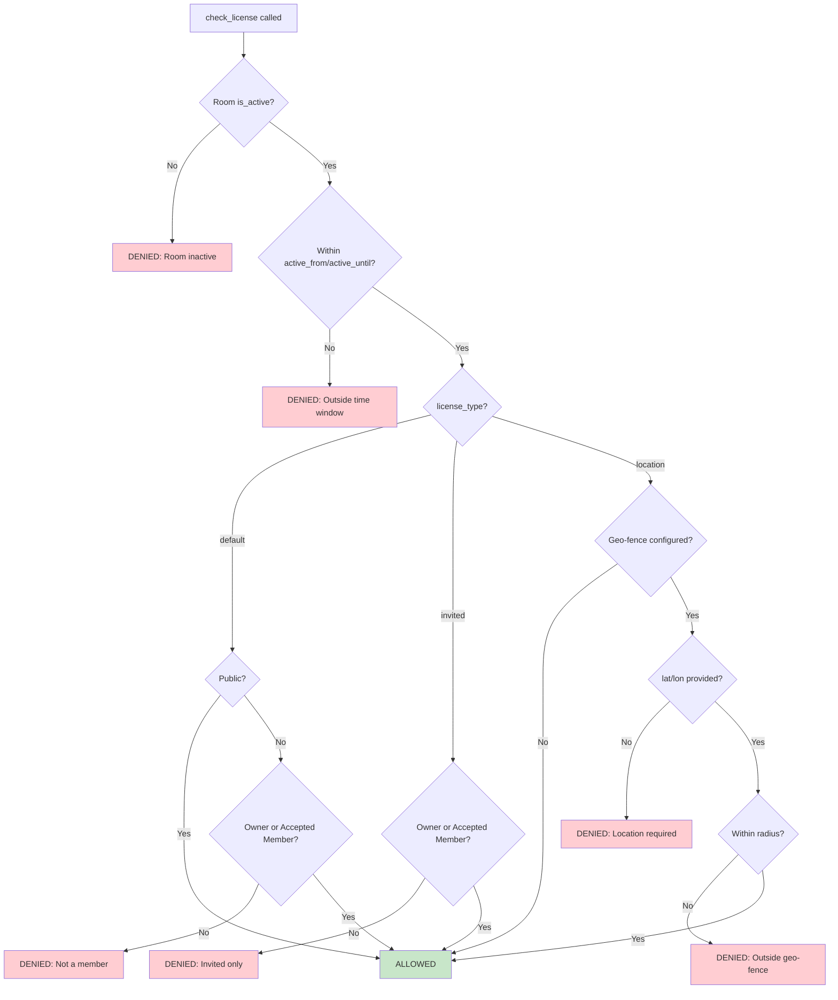

---

## Summary Tables

### Endpoint Count by Controller

| Controller | Endpoints | Key Operations |
|------------|-----------|----------------|
| Auth | 3 | Login, Token Refresh, Logout |
| Register | 1 | User Registration |
| Profile | 1 (3 methods) | GET / PATCH / DELETE profile |
| Password | 4 | Forgot → Verify Code → Reset, Change |
| OAuth | 1 | Google / Facebook login |
| Friends | 9 | Send / Accept / Decline / Block, List, Search |
| Rooms | 12 | CRUD, Members, Invitations, Kick, Leave |
| Admin | 3 | User List/Detail/Delete + Action Logs |
| Music Preferences | 1 (3 methods) | GET / PUT / PATCH preferences |
| Music Track Vote | **4** | List (ranked), Suggest, Vote, **Delete** |
| Music Control Delegation | 5 | List, Register, Delegate, Revoke, Status |
| WebSocket | 2 | Vote Updates, Delegation Updates |
| **Total** | **46** | |

### Authentication Summary

| Type | Controllers |
|------|-------------|
| **Public (No Auth)** | Auth, Register, Password reset flow, OAuth |
| **Authenticated (JWT Bearer)** | Profile, Friends, Rooms, Music Prefs, Track Vote, Delegation |
| **Staff/Admin Role** | Admin users list + Action logs |
| **WebSocket (JWT query param)** | `ws/events/*`, `ws/delegation/*` |

### Concurrency Strategies

| Service | Strategy | Mechanism |
|---------|----------|-----------|
| Track Vote (vote) | Atomic increment | `transaction.atomic()` + `F('vote_count') + 1` + `Vote.unique_together` |
| Track Vote (suggest) | Duplicate rejection | `Track.unique_together (room, spotify_id)` + `IntegrityError → 409` |
| Delegation | Simple update | Single-row update (no concurrent conflict risk) |

### Rate Limits

| Endpoint | Limit | Throttle Class |
|----------|-------|----------------|
| `/api/token/` | 10/min | `LoginRateThrottle` |
| `/api/signup/` | 10/min | `RegisterRateThrottle` |
| `/api/forgot-password/` | 5/min | `PasswordResetRateThrottle` |
| All authenticated users | 300/min | `UserRateThrottle` |
| Anonymous users | 60/min | `AnonRateThrottle` |

---

## Common Response Codes

| Code | Meaning | Example |
|------|---------|---------|
| `200 OK` | Success with data | GET, PATCH, vote, OAuth login |
| `201 Created` | Resource created | POST signup, room, track, device |
| `204 No Content` | Success, no body | DELETE room, leave room, delete track |
| `400 Bad Request` | Validation / business logic error | Missing field, wrong password, non-vote room |
| `401 Unauthorized` | Missing or invalid JWT | Expired or absent `Authorization` header |
| `403 Forbidden` | Authenticated but unauthorised | Non-owner deleting, license check failed |
| `404 Not Found` | Resource doesn't exist | Bad room/track/device ID |
| `409 Conflict` | Duplicate resource | Duplicate email, duplicate spotifyId in room |
| `500 Internal Server Error` | Unhandled server exception | Unexpected crash |

---

## Authentication Flow Diagram

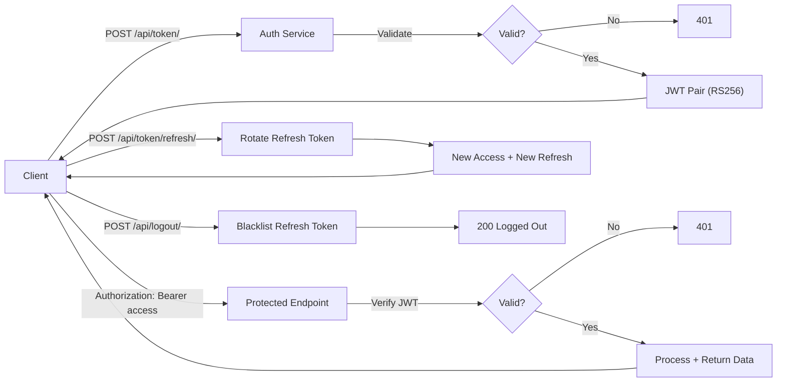

---

**Document Version:** 3.0  
**Last Updated:** April 16, 2026  
**Changes in v3.0:**
- ✅ Corrected Signup fields (`full_name`, `email`, `password`, `confirm_password`)
- ✅ Updated Password reset flow to 6-digit code + verify endpoint
- ✅ Fully rewrote Track Vote section: `spotifyId`, `albumArt`, `audioUrl`, `addedBy`, `votes`, `vote_count`, `rank`, `has_voted`
- ✅ Added missing **DELETE track** endpoint with 409 / cascade / re-add behaviour
- ✅ Updated Room schema to camelCase (`coverImage`, `isPublic`, `isLive`, `participantCount`, `host`, `createdAt`, `currentTrack`)
- ✅ Updated WebSocket section: `track.added`, `vote.update`, `track.removed` event types
- ✅ Added Admin user CRUD endpoints
- ✅ Corrected Summary table (46 endpoints, 4 track-vote endpoints)
- ✅ Added `track_deleted` to Action Log events
